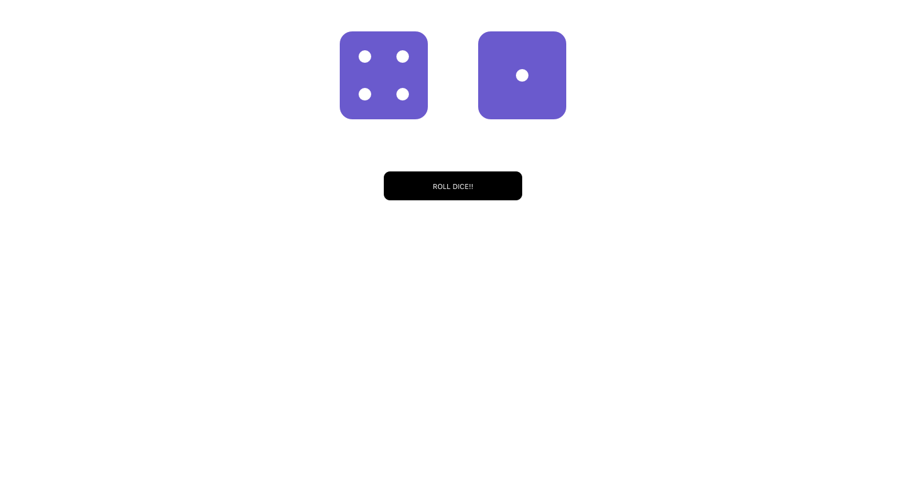

# Roll Dice - This is an exercise project that lets you pratice with props, defaultProps, state, and simple click events in React.

[RollDice](https://react-roll-dice.netlify.com/) is a random roll-dice game built as an exercise for this [tutorial](https://www.udemy.com/course/modern-react-bootcamp/).



## Table of content

- [Description](#description)
- [Installation](#installation)
- [Contact](#contact)

## Description

React Roll Dice can pick a random element from the array for each die, then update the state, causing the dice to re-render to the appropriate values.

## Installation

1. Clone the project to your local directory

```
git clone https://github.com/KaushikShivam/roll-dice
```

2. The project uses NPM for managing dependencies. Run npm install to install all the required dependencies

```
npm install
```

3. Run the task runner to run the app

```
npm run start
```

## Contact

You can contact me at:

- [Portfolio](https://www.shivamkaushik.com)
- [Email](mailto:shivamkaushikofficial@gmail.com)
- [Linkedin](https://www.linkedin.com/in/kshivamdev/)
- [Twitter](https://twitter.com/kShivamDev)
- [Medium](https://medium.com/@shivamkaushikofficial)
- [Angellist](https://angel.co/kshivamdev)
